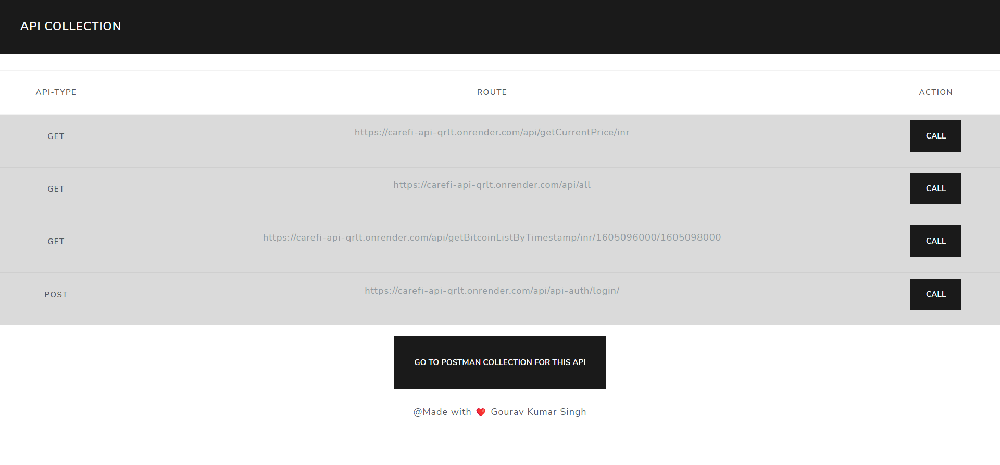
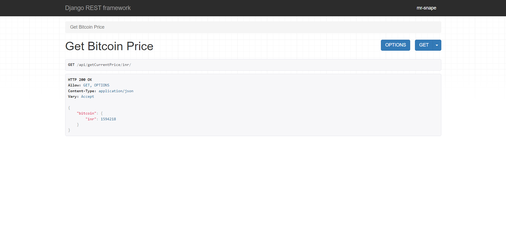
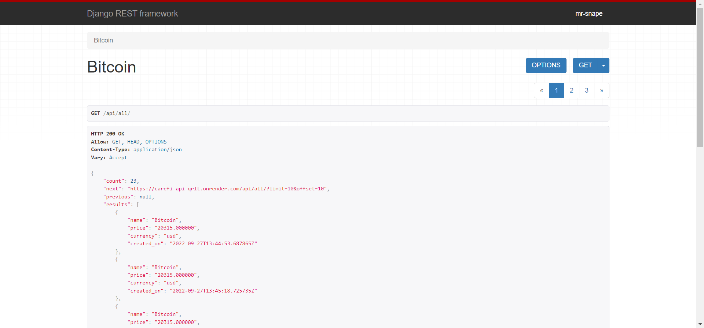
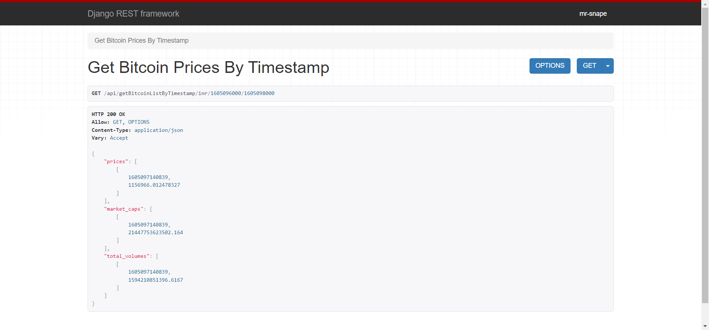
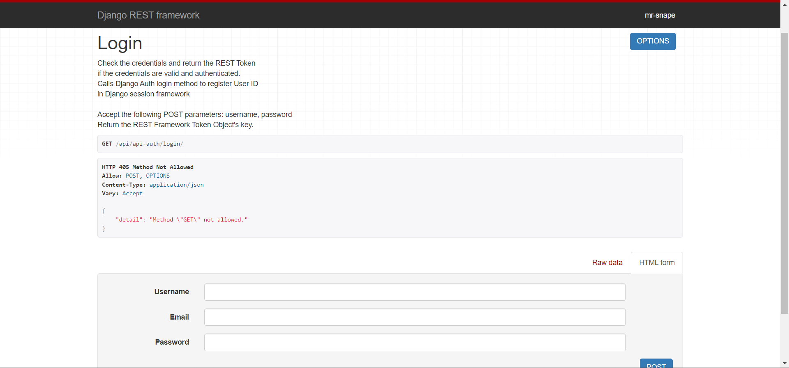

# CareFI API
 
 

## Website Link <a href="https://carefi-api-qrlt.onrender.com/">CareFi-API</a>
1. This project is based on getting the real time `Bitcoin` Price in any currency.
2. Also it will store the `Bitcoin` Price in database (`PostgreSQL` of render.com).

## Home Page

* `https://carefi-api-qrlt.onrender.com/api/getCurrentPrice/{currency}` for getting the current price.

* `https://carefi-api-qrlt.onrender.com/api/all` for getting all the stored data from database.

* `https://carefi-api-qrlt.onrender.com/api/getBitcoinListByTimestamp/{currency}/{from_timestamp}/{to_timestamp}` for getting the `Bitcoin` price using `Timestamp`

*`https://carefi-api-qrlt.onrender.com/api/api-auth/login/` this api for auth.

